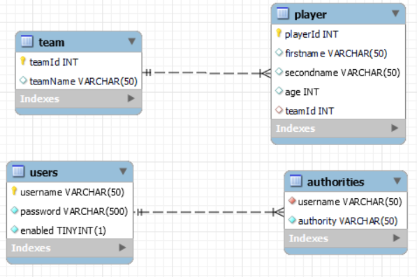

# FootballTeamApplication M295 Zara Ramirez
## Overview
* [Einrichtung](#Einrichtung)
* [Datenmodell](#Datenmodell)
* [SQL Code](#SQLCode)
* [Datenbankverbindung](#Datenbankverbindung)
* [Applikation](Applikation)
* [Testfall Logger](#TestfallLogger)
* [Security](Security)
* [Reflektion](Reflektion)
## Einrichtung
Ich habe mich entschieden eine Applikation zu erstellen die bei jedem Spieler eingefügt wird in
welcher Mannschaft die Person spielt.

## Datenmodell


Ich habe 4 Tabellen erstellt einmal Team damit jedes Team auf sein eigenes Id hat und Player mit der 
Daten des Spieler (Vorname, Nachname, Alter) und mit einer Foreign Key mit der Id vom Team (teamId).

Die andere zwei Tabellen users und authorities sind da damit der WebSecurity funktioniert.

## SQL Code

DROP DATABASE IF EXISTS `football` ;

CREATE DATABASE `football`
CREATE SCHEMA IF NOT EXISTS `football` DEFAULT CHARACTER SET utf8mb4 COLLATE utf8mb4_0900_ai_ci ;
USE `football` ;

CREATE TABLE IF NOT EXISTS `football`.`users` (
`username` VARCHAR(50) NOT NULL,
`password` VARCHAR(500) NOT NULL,
`enabled` TINYINT(1) NOT NULL,
PRIMARY KEY (`username`))
ENGINE = InnoDB
DEFAULT CHARACTER SET = utf8mb4
COLLATE = utf8mb4_0900_ai_ci;


CREATE TABLE IF NOT EXISTS `football`.`authorities` (
`username` VARCHAR(50) NOT NULL,
`authority` VARCHAR(50) NOT NULL,
INDEX `fk_authorities_users` (`username` ASC) VISIBLE,
CONSTRAINT `fk_authorities_users`
FOREIGN KEY (`username`)
REFERENCES `football`.`users` (`username`))
ENGINE = InnoDB
DEFAULT CHARACTER SET = utf8mb4
COLLATE = utf8mb4_0900_ai_ci;

CREATE TABLE IF NOT EXISTS `football`.`team` (
`teamId` INT NOT NULL,
`teamName` VARCHAR(50) NULL DEFAULT NULL,
PRIMARY KEY (`teamId`))
ENGINE = InnoDB
DEFAULT CHARACTER SET = utf8mb4
COLLATE = utf8mb4_0900_ai_ci;

CREATE TABLE IF NOT EXISTS `football`.`player` (
`playerId` INT NOT NULL,
`firstname` VARCHAR(50) NULL DEFAULT NULL,
`secondname` VARCHAR(50) NULL DEFAULT NULL,
`age` INT NULL DEFAULT NULL,
`teamId` INT NULL DEFAULT NULL,
PRIMARY KEY (`playerId`),
INDEX `teamId` (`teamId` ASC) VISIBLE,
CONSTRAINT `player_ibfk_1`
FOREIGN KEY (`teamId`)
REFERENCES `football`.`team` (`teamId`))
ENGINE = InnoDB
DEFAULT CHARACTER SET = utf8mb4
COLLATE = utf8mb4_0900_ai_ci;

SET SQL_MODE=@OLD_SQL_MODE;
SET FOREIGN_KEY_CHECKS=@OLD_FOREIGN_KEY_CHECKS;
SET UNIQUE_CHECKS=@OLD_UNIQUE_CHECKS;

## Datenbankverbindung
Um die Datenbankverbindung herzustellen, musst man in der Klasse [application.properties](src/main/resources/application.properties) die Datenbankverbindung anpassen.
```properties
spring.datasource.url=jdbc:mysql://localhost:3306/football
spring.datasource.username=
spring.datasource.password=
```
Den Benutzername und den Passwort einfügen und die richtig URL einfügen, falls man einen anderen Port verwendet.

## Applikation
Die restapi.yaml findest du hier: [restapi.yaml](src/main/resources/restapi.yaml)

Um die Applikation zu starten muss man auf diese Klasse ausführen:

[FootballTeamApplication](src/main/java/com/example/fussballmannschaft/FootballTeamApplication.java)

Um die Test überprüfen muss man auf diese Klasse ausführen:

[FussballMannschaftApplicationTest](src/test/java/com/example/fussballmannschaft/FussballMannschaftApplicationTests.java)

Um Spieler oder Teams auswählen, hinzufügen, updaten und löschen dan kannst du das mit diesem Link:

Spieler -> http://localhost:8080/players

Team -> http://localhost:8080/teams


## Testfall Logger
Das ist die Folgende Klasse die ich getestet habe: [PlayerDao](src/main/java/com/example/fussballmannschaft/player/PlayerDao.java)

und auf folgende habe ich die Logger eingefügt: [PlayerController](src/main/java/com/example/fussballmannschaft/player/PlayerController.java)
und [TeamController](src/main/java/com/example/fussballmannschaft/Team/TeamController.java)

## Security
In dieser Klasse habe ich die SecurityConfig erstellt: [SecurityConfig](src/main/java/com/example/fussballmannschaft/Securitiy/SecurityConfig.java) 
Dies habe ich nur für die Spieler erstellt.
```Java

    if (!users.userExists("admin")) {
        UserDetails admin = User.builder()
                .username("admin")
                .password(passwordEncoder().encode("adminpassword"))
                .roles("USER", "ADMIN")
                .build();
        users.createUser(admin);
    }

    return users;
```
Wie man hier sieht wäre der User **"admin"** und das Passwort **"adminpassword"**.


## Reflektion
Ich hatte mühe es schnell zu verstehen da ich mich nicht gut mit diesem Thema auskenne. Am Anfang vom Projekt hatte ich noch komplikationen mit der Datenbank,
da ich es neu installieren musste, schlussendlich konnte ich es mithilfe beheben. Während dem Projekt habe ich das Thema immer verständlicher und mithilfe von Kollegen oder vom Dozent hat mir sehr geholfen.
